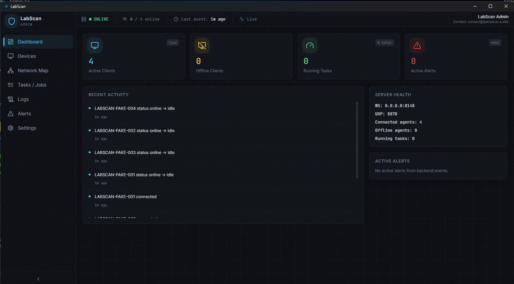
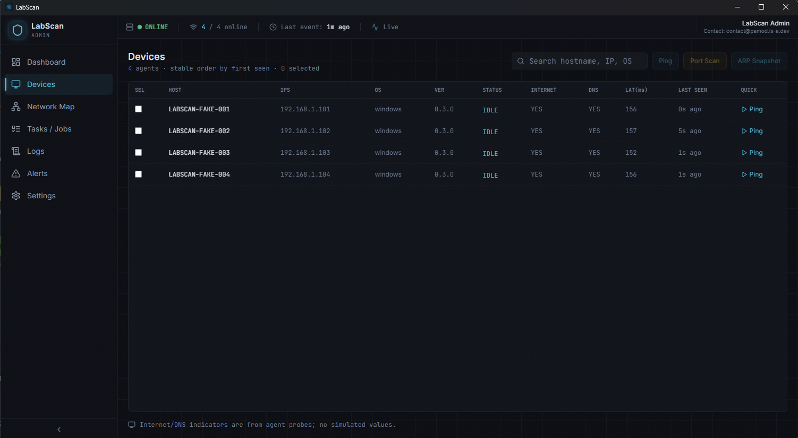
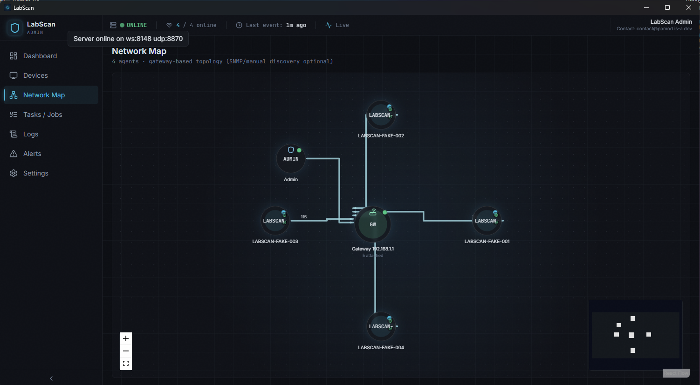

<div align="center">
  
  
  # LabScan
  
  *A local network monitoring and management system built for controlled environments like labs, classrooms, and small offices.*
  
  ---
</div>

LabScan is a LAN monitoring prototype with:

- `admin/` - Tauri desktop app (React UI + embedded Rust server)
- `agent/` - headless Go agent running on monitored machines

## MVP transport and protocol

- Transport: websocket (`/ws/agent`)
- Message shape: JSON envelope with `type`, `ts`, `agent_id`, `payload`
- Auth: shared secret in `register` payload

## Run the demo

### 1) Start admin

```bash
cd admin
npm install
npm run tauri dev
```

By default, the embedded server uses:
- WebSocket endpoint: `ws://0.0.0.0:8148/ws/agent`
- UDP discovery: port `8870` for multicast beacons

### 2) Start one or more agents

```bash
cd agent
go build -o labscan-agent.exe .
labscan-agent.exe -admin-url ws://<ADMIN_IP>:8148/ws/agent -secret labscan-dev-secret
```

### 3) Verify flow in UI

1. Agent appears in **Devices**.
2. Select agent(s), dispatch `Ping`, `Port Scan`, or `ARP Snapshot`.
3. Observe progress/results in **Tasks** and live events in **Logs**.

## Port Configuration

**Admin Server Ports:**
- **WebSocket Communication**: `8148` (agent connections)
- **UDP Discovery**: `8870` (multicast beacon listening)

**Agent Communication:**
- Outbound WebSocket connection to admin server on port `8148`
- Local UDP listening on port `8870` for discovery beacons

## Firewall Configuration

**Windows:**
- Allow inbound TCP port `8148` for admin app WebSocket
- Allow inbound UDP port `8870` for discovery (optional)
- Agents need outbound TCP access to admin host on `8148`

**Linux/macOS:**
```bash
# Ubuntu/Debian
sudo ufw allow 8148/tcp
sudo ufw allow 8870/udp

# CentOS/RHEL
sudo firewall-cmd --permanent --add-port=8148/tcp
sudo firewall-cmd --permanent --add-port=8870/udp
sudo firewall-cmd --reload
```

## Current scope

- In-memory runtime state (devices, tasks, logs, connections)
- Network map is gateway-based by default; advanced switch discovery requires explicit SNMP/manual mapping
- Realtime UI updates via Tauri events (`labscan://state`)
- Agent reconnect with bounded exponential backoff
- No remote command execution (by design)

## Screenshots

<div align="center">
  
  <p><em>Admin Dashboard - Overview of connected devices and network status</em></p>
  
  
  <p><em>Device List - Detailed view of all monitored devices</em></p>
  
  
  <p><em>Network Visualization - Topology view of connected devices</em></p>
</div>
